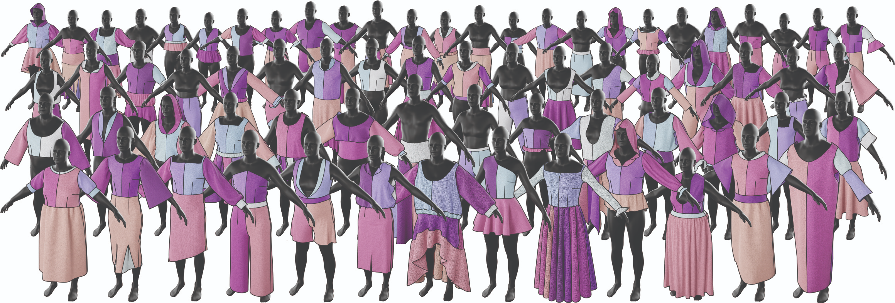
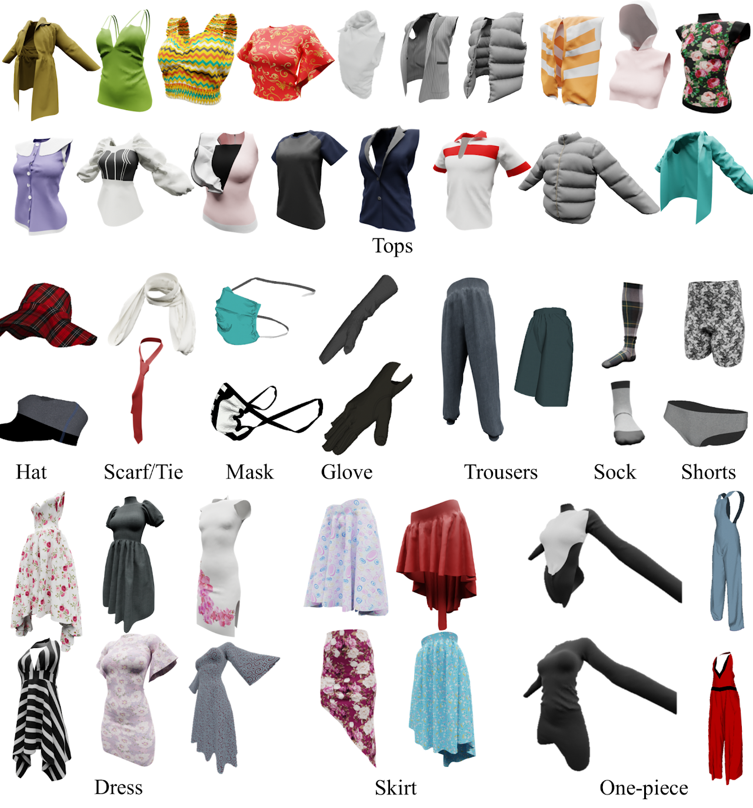
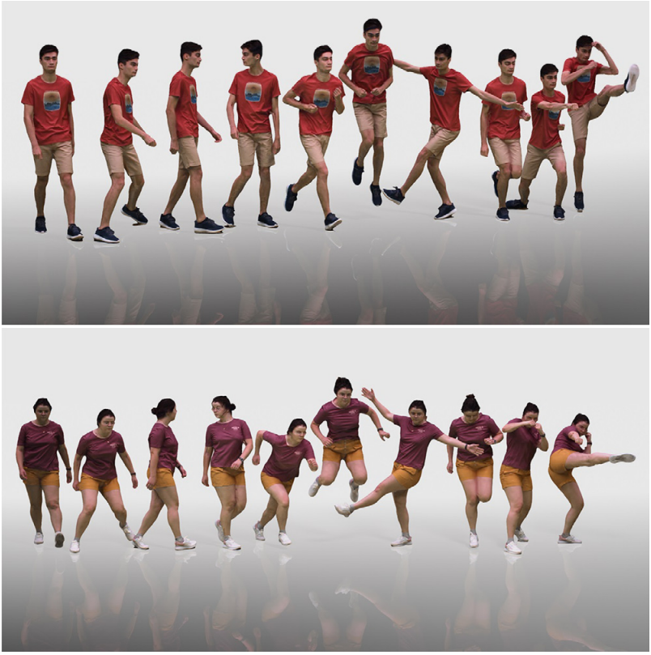

# Awesome-3D-Garments

Curation of research papers and datasets related to 3D garment digitization and simulation

Table of Contents
=================

- [Courses](#courses)
- [Papers](#papers)
	- [Classical Cloth Simulation](#classical-cloth-simulation)
 	- [Collision Handling and Contact Friction Modeling](#collision-handling-and-contact-friction-modeling)
	- [Neural Cloth Simulation](#neural-cloth-simulation)
	- [DL for Simulation](#dl-for-simulation)
	- [Inverse Cloth Simulation](#inverse-cloth-simulation)
	- [Avatar Generation](#avatar-generation)
   	- [Garment Generation](#garment-generation)
  	- [Dynamic Human Reconstruction from Multiview Video](#dynamic-human-reconstruction-from-multiview-video)
  	- [Dynamic Human Reconstruction from Monocular Video](#dynamic-human-reconstruction-from-monocular-view)
  	- [Garment Reconstruction from Monocular Video](#garment-reconstruction-from-monocular-video)
  	- [Garment Reconstruction from Multiview Images or Video](#garment-reconstruction-from-multiview-images-or-video)
  	- [Panel Based Garment Representation](#panel-based-garment-reconstruction)
  	- [Clothed Human Reconstruction from Monocular Image or Video](#clothed-human-reconstruction-from-monocular-image-or-video)
  	- [Learning Clothed Human Deformation from 3D scans](#learning-clothed-human-deformation-from-3d-scans)
  	- [Garment Retargetting](#garment-retargetting)
   	- [Virtual Try On](#virtual-try-on)
   	
- [Datasets](#datasets)
	- [Draped Garment Dataset](#draped-garment-dataset)
	- [Garment Manipulation Dataset](#garment-manipulation-dataset)
	- [Clothed Human Dataset](#clothed-human-dataset)

# Courses
- [Physics Based Animation](https://github.com/dilevin/CSC417-physics-based-animation?tab=readme-ov-file)
- Cloth Simulation: [1](https://graphics.stanford.edu/~mdfisher/cloth.html#EquationsOfMotion) [2](https://cg.informatik.uni-freiburg.de/course_notes/sim_03_cloth1.pdf)
- [Linear Implicit Solver](https://people.engr.tamu.edu/sueda/courses/CSCE489/2021F/assignments/A5/index.html)
- FEM Simulation of 3D Deformable Solids: [1](https://viterbi-web.usc.edu/~jbarbic/femdefo/barbic-courseNotes-modelReduction.pdf) [2](https://viterbi-web.usc.edu/~jbarbic/femdefo/barbic-courseNotes-modelReduction.pdf)

# Papers
## Classical Cloth Simulation 
- [Large Steps in Cloth Simulation](https://www.cs.cmu.edu/~baraff/papers/sig98.pdf)
- [Numerical Methods in Cloth Simulation](https://www.wuwayne.com/files/clothsim/report.pdf)  
- [Implicit and Explicit Methods of Cloth Simulation](https://www.cs.ru.ac.za/research/groups/vrsig/pastprojects/052cloth/paper03.pdf)  
- [Position Based Dynamics](https://matthias-research.github.io/pages/publications/posBasedDyn.pdf) 
  	#### Implementation
  	- [PBD](https://carmencincotti.com/2022-07-11/position-based-dynamics/)
  	- [Velvet](https://github.com/vitalight/Velvet)
  	  
- [Adaptive Anisotropic Remeshing for Cloth Simulation](http://graphics.berkeley.edu/papers/Narain-AAR-2012-11/Narain-AAR-2012-11.pdf)
	#### Implementations:
	- [ArcSim](https://github.com/DanielTakeshi/ARCSim-Installation-Instructions)
	- [Argus](https://github.com/lijieumn/argus-distribution)
- [Cloth simulation and collision detection using geometry images](https://ujcontent.uj.ac.za/esploro/outputs/graduate/Cloth-simulation-and-collision-detection-using/9910105707691/filesAndLinks?index=0)
 - [Multi-Layer Thick Shells](https://dl.acm.org/doi/pdf/10.1145/3588432.3591489) 

## Collision Handling and Contact Friction Modeling
#### 2022
- [DiffCloth: Differentiable Cloth Simulation with Dry Frictional Contact](https://people.csail.mit.edu/liyifei/uploads/Li-liyifei-SM-EECS-2022-thesis.pdf) \
  Yifei Li, Tao Du, Kui Wu, Jie Xu, Wojciech Matusik \
  ACM TOG, 2022
#### 2020
- [Incremental Potential Contact: Intersection- and Inversion-free, Large-Deformation Dynamics](https://dl.acm.org/doi/pdf/10.1145/3386569.3392425) \
  Minchen Li,  Zachary Ferguson,  Teseo Schneider,  Timothy Langlois,  Denis Zorin,  Daniele Panozzo, Chenfanfu Jiang,  Danny M. Kaufman \
  SIGGRAPH, 2020
#### 2018
- [An Implicit Frictional Contact Solver for Adaptive Cloth Simulation](https://www-users.cselabs.umn.edu/~lixx4611/contact_friction.html) \
  Jie Li, Gilles Daviet, Rahul Narain, Florence Bertails-Descoubes, Matthew Overby, George Brown, Laurence Boissieux \
  SIGGRAPH, 2018
- [Inverse Elastic Shell Design with Contact and Friction](https://inria.hal.science/hal-01883655/file/inverseShellModeling.pdf) \
  Mickaël Ly, Romain Casati, Florence Bertails-Descoubes, Mélina Skouras, Laurence Boissieux \
  SIGGRAPH Asia, 2018
- [I-Cloth: Incremental Collision Handling for GPU-Based Interactive Cloth Simulation](https://min-tang.github.io/home/ICloth/files/icloth.pdf) \
  Min Tang , Tongtong Wang, Zhongyuan Liu, Ruofeng Tong, and Dinesh Manocha \
  SIGGRAPH Asia, 2018
#### 2009
- [Implicit Contact Handling for Deformable Objects](https://media.disneyanimation.com/uploads/production/publication_asset/32/asset/EG2009_implicit_contact.pdf) \
  Miguel A. Otaduy, Rasmus Tamstorf, Denis Steinemann, Markus Gross \
  EUROGRAPHICS, 2009
#### 2002
- [Robust Treatment of Collisions, Contact and Friction for Cloth Animation](https://graphics.stanford.edu/papers/cloth-sig02/cloth.pdf) \
  Robert Bridson, Ronald Fedkiw, John Anderson \
  SIGGRAPH, 2002

## Neural Cloth Simulation
#### 2024
- [Bayesian Differentiable Physics for Cloth Digitalization](https://openaccess.thecvf.com/content/CVPR2024/papers/Gong_Bayesian_Differentiable_Physics_for_Cloth_Digitalization_CVPR_2024_paper.pdf) \
  Deshan Gong, Ningtao Mao, He Wang \
  CVPR, 2024
- [A Neural-Network-Based Approach for Loose-Fitting Clothing](https://arxiv.org/pdf/2404.16896) \
  YONGXU JIN, DALTON OMENS, ZHENGLIN GENG, JOSEPH TERAN, ABISHEK KUMAR, KENJI TASHIRO, RONALD FEDKIW \
  ArXiv, 2024
#### 2023
- [Data-Free Learning of Reduced-Order Kinematics](https://nmwsharp.com/media/papers/neural-physics-subspaces/neural_physics_subspaces.pdf) \
  Nicholas Sharp, Cristian Romero, Alec Jacobson, Etienne Vouga, Paul Kry, David I.W. Levin, Justin Solomon \
  SIGGRAPH '23: ACM SIGGRAPH 2023 Conference Proceedings
- [NeuralClothSim: Neural Deformation Fields Meet the Kirchhoff-Love Thin Shell Theory](https://arxiv.org/pdf/2308.12970.pdf) \
  Navami Kairanda, Marc Habermann, Christian Theobalt and Vladislav Golyanik \
  NeurIPS, 2024

## DL for Simulation
#### 2024
- [Neural Garment Dynamics via Manifold-Aware Transformers](https://peizhuoli.github.io/manifold-aware-transformers/) \
  Peizhuo Li, Tuanfeng Y. Wang, Timur Levent Kesdogan, Duygu Ceylan, Olga Sorkine-Hornung \
  EUROGRAPHICS 2024
  
- [SENC: Handling Self-collision in Neural Cloth Simulation](https://zycliao.com/senc/) \
  Zhouyingcheng Liao, Sinan Wang, Taku Komura \
  ECCV 2024
  
- [ContourCraft: Learning to Resolve Intersections in Neural Multi-Garment Simulations](https://dl.acm.org/doi/pdf/10.1145/3641519.3657408) \
  Artur Grigorev, Giorgio Becherini, Michael Black, Otmar Hilliges, Bernhard Thomaszewski \
  SIGGRAPH, 2024
  
- [GAPS: Geometry-Aware, Physics-Based, Self-Supervised Neural Garment Draping](https://arxiv.org/pdf/2312.01490.pdf) | [Code](https://github.com/simonhfls/gaps) \
  Ruochen Chen, Liming Chen, Shaifali Parashar \
  3DV, 2024
  
- [HOOD: Hierarchical Graphs for Generalized Modelling of Clothing Dynamics](https://arxiv.org/pdf/2212.07242.pdf) | [Code](https://github.com/Dolorousrtur/HOOD/tree/main) \
  Artur Grigorev, Bernhard Thomaszewski, Michael J. Black, Otmar Hilliges \
  CVPR, 2024

- [DiffusedWrinkles: A Diffusion-Based Model for Data-Driven Garment Animation](https://bmva-archive.org.uk/bmvc/2024/papers/Paper_352/paper.pdf)\
  Raquel Vidaurre, Elena Garcés, Dan Casas \
  BMVC, 2024

  
#### 2023
- [Towards Multi-Layered 3D Garments Animation](https://arxiv.org/pdf/2305.10418) \
  Yidi Shao, Chen Change Loy, Bo Dai \
  ICCV, 2023
- [GenSim: Unsupervised Generic Garment Simulator](https://openaccess.thecvf.com/content/CVPR2023W/DLGC/papers/Tiwari_GenSim_Unsupervised_Generic_Garment_Simulator_CVPRW_2023_paper.pdf) \
  Lokender Tiwari Brojeshwar Bhowmick Sanjana Sinha \
  CVPR Workshop, 2023
#### 2022
- [Neural Cloth Simulation](https://dl.acm.org/doi/pdf/10.1145/3550454.3555491) | [Code](https://github.com/hbertiche/NeuralClothSim/) \
  HUGO BERTICHE, MEYSAM MADADI, and SERGIO ESCALERA \
  SIGGRAPH Asia 2022
- [SNUG: Self-Supervised Neural Dynamic Garments](https://arxiv.org/pdf/2204.02219.pdf) | [Code](https://github.com/isantesteban/snug/tree/main) \
  Igor Santesteban, Miguel A. Otaduy, and Dan Casas \
  CVPR, 2022
#### 2019
- [Learning-Based Animation of Clothing for Virtual Try-On](https://arxiv.org/pdf/1903.07190) \
  Igor Santesteban, Miguel A. Otaduy, Dan Casas \
  EUROGRAPHICS, 2019

  
## Inverse Cloth Simulation

#### 2025
- [SAFT: Shape and Appearance of Fabrics from Template via Differentiable Physical Simulations from Monocular Video](https://openaccess.thecvf.com/content/ICCV2025/papers/Stotko_SAFT_Shape_and_Appearance_of_Fabrics_from_Template_via_Differentiable_ICCV_2025_paper.pdf) \
	David Stotko, Reinhard Klein \
	ICCV, 2025
- [Thin-Shell-SfT: Fine-Grained Monocular Non-rigid 3D Surface Tracking with Neural Deformation Fields](https://openaccess.thecvf.com/content/CVPR2025/papers/Kairanda_Thin-Shell-SfT_Fine-Grained_Monocular_Non-rigid_3D_Surface_Tracking_with_Neural_Deformation_CVPR_2025_paper.pdf) \
	Navami Kairanda, Marc Habermann1, Shanthika Naik, Christian Theobalt, Vladislav Golyanik \
	CVPR, 2025
#### 2023
- [DiffXPBD : Differentiable Position-Based Simulation of Compliant Constraint Dynamics](https://arxiv.org/pdf/2301.01396.pdf) \
  Tuur Stuyck, Hsiao-yu Chen \
  ACM- Computer Graphics and Interactive Techniques, 2023
#### 2022
- [Φ-SfT: Shape-from-Template with a Physics-Based Deformation Model](https://4dqv.mpi-inf.mpg.de/phi-SfT/) | [Code](https://github.com/navamikairanda/phi_sft/tree/main) \
  Navami Kairanda, Edith Tretschk, Mohamed Elgharib, Christian Theobalt, Vladislav Golyanik \
  CVPR, 2022
#### 2019
- [Differentiable Cloth Simulation for Inverse Problems](https://gamma.umd.edu/researchdirections/virtualtryon/differentiablecloth) | [Code](https://github.com/williamljb/DifferentiableCloth/tree/master?tab=readme-ov-file) \
  Junbang Liang, Ming C. Lin, Vladlen Koltun \
  NeurIPS, 2019
  

## Avatar Generation
#### 2024
- [GAvatar: Animatable 3D Gaussian Avatars with Implicit Mesh Learning](https://nvlabs.github.io/GAvatar) \
  Ye Yuan, Xueting Li, Yangyi Huang, Shalini De Mello, Koki Nagano, Jan Kautz, Umar Iqbal \
  CVPR, 2024 (Highlight)
#### 2022
- [Dressing Avatars: Deep Photorealistic Appearance for Physically Simulated Clothing](https://arxiv.org/pdf/2206.15470.pdf) \
  Donglai Xiang, Timur Bagautdinov, Tuur Stuyck, Fabian Prada, Javier Romero, Weipeng Xu, Shunsuke Saito, Jingfan Guo, Breannan Smith, Takaaki Shiratori, 
  Yaser Sheikh, Jessica Hodgins, and Chenglei Wu \
  ACM Transactions on Graphics (TOG), 2022
  
## Garment Generation
#### 2024
- [DressCode: Autoregressively Sewing and Generating Garments from Text Guidance](https://ihe-kaii.github.io/DressCode/) \
  Kai He, Kaixin Yao, Qixuan Zhang, Jingyi Yu, Lingjie Liu, Lan Xu \
  SIGGRAPH, 2024
- [Design2Cloth: 3D Cloth Generation from 2D Masks](https://jiali-zheng.github.io/Design2Cloth/) \
  Jiali Zheng, Rolandos Alexandros Potamias, Stefanos Zafeiriou \
  CVPR, 2024
- [Garment3DGen: 3D Garment Stylization and Texture Generation](https://nsarafianos.github.io/garment3dgen) \
  Nikolaos Sarafianos, Tuur Stuyck, Xiaoyu Xiang, Yilei Li, Jovan Popovic, Rakesh Ranjan \
  ArXiv, 2024
- [GarmentDreamer: 3DGS Guided Garment Synthesis with Diverse Geometry and Texture Details](https://arxiv.org/pdf/2405.12420) \
  Boqian Li, Xuan Li, Ying Jiang, Tianyi Xie, Feng Gao, Huamin Wang, Yin Yang, Chenfanfu Jiang \
  ArXiv, 2024
- [WordRobe: Text-Guided Generation of Textured 3D Garments](https://arxiv.org/pdf/2403.17541) \
  Astitva Srivastava, Pranav Manu, Amit Raj, Varun Jampani, Avinash Sharma \
  ECCV, 2024

## Dynamic Human Reconstruction from Multiview Video
#### 2024
- [Animatable and Relightable Gaussians for High-fidelity Human Avatar Modeling](https://arxiv.org/pdf/2311.16096)\
  Zhe Li, Yipengjing Sun, Zerong Zheng, Lizhen Wang, Shengping Zhang, Yebin Liu \
  CVPR, 2024 \
  NOTE: Map to Canonical
- [PhysAvatar: Learning the Physics of Dressed 3D Avatars from Visual Observations](https://arxiv.org/pdf/2404.04421.pdf) \
  Yang Zheng, Qingqing Zhao, Guandao Yang, Wang Yifan, Donglai Xiang, Florian Dubost, Dmitry Lagun, Thabo Beeler, Federico Tombari, Leonidas Guibas, Gordon Wetzstein \
  ArXiv, 2024
#### 2022
- [ARAH: Animatable Volume Rendering of Articulated Human SDFs](https://neuralbodies.github.io/arah/) \
  Shaofei Wang,  Katja Schwarz,  Andreas Geiger,  Siyu Tang \
  ECCV, 2022
- [TAVA: Template-free Animatable Volumetric Actors](https://github.com/facebookresearch/tava) \
  Ruilong Li,Julian Tanke, Minh Vo, Michael Zollhoefer, Jürgen Gall, Angjoo Kanazawa, Christoph Lassner \
  ECCV, 2022

## Dynamic Human Reconstruction from Monocular Video
#### 2024
- [ReLoo: Reconstructing Humans Dressed in Loose Garments from Monocular Video in the Wild](https://moygcc.github.io/ReLoo/) \
  Chen Guo, Tianjian Jiang, Manuel Kaufmann, Chengwei Zheng, Julien Valentin, Jie Song, Otmar Hilliges \
  ECCV 2024
- [GaussianAvatar: Towards Realistic Human Avatar Modeling from a Single Video via Animatable 3D Gaussians](https://openaccess.thecvf.com/content/CVPR2024/html/Hu_GaussianAvatar_Towards_Realistic_Human_Avatar_Modeling_from_a_Single_Video_CVPR_2024_paper.html) \
  Liangxiao Hu, Hongwen Zhang, Yuxiang Zhang, Boyao Zhou, Boning Liu, Shengping Zhang, Liqiang Nie \
  CVPR, 2024 \
  NOTE: Map to Canonical T-pose
- [GaussianBody: Clothed Human Reconstruction via 3d Gaussian Splatting](https://arxiv.org/pdf/2401.09720) \
  Mengtian Li, Shengxiang Yao, Zhifeng Xie, Keyu Chen \
  ArXiv, 2024 \
  NOTE: Map to Canonical T-pose
  
  
## Garment Reconstruction from Monocular Video
#### 2025
- [NGD: Neural Gradient Based Deformation for Monocular Garment Reconstruction](https://astonishingwolf.github.io/pages/NGD/) \
	Soham Dasgupta, Shanthika Naik, Preet Savalia, Sujay Kumar Ingle, Avinash Sharma \
	ICCV, 2025
#### 2023
- [REC-MV: REconstructing 3D Dynamic Cloth from Monocular Videos](https://github.com/GAP-LAB-CUHK-SZ/REC-MV) \
  Lingteng Qiu1, Guanying Chen, Jiapeng Zhou, Mutian Xu, Junle Wang, Xiaoguang Han \
  CVPR, 2023 \
  NOTE:  Deformation of T-pose template mesh
#### 2022
- [PERGAMO: Personalized 3D Garments from Monocular Video](https://arxiv.org/pdf/2210.15040) \
  Andrés Casado-Elvira, Marc Comino Trinidad, Dan Casas \
  SIGGRAPH, 2022
#### 2021
- [Deep Physics-aware Inference of Cloth Deformation for Monocular Human Performance Capture](https://arxiv.org/pdf/2011.12866) \
  Yue Li, Marc Habermann, Bernhard Thomaszewski, Stelian Coros, Thabo Beeler and Christian Theobalt \
  3DV, 2021 \
  NOTE: Temporal deformation
  
## Garment Reconstruction from Multiview Images or Videos
#### 2025
- [PGC: Physics-Based Gaussian Cloth from a Single Pose](https://phys-gaussian-cloth.github.io/) \
	Michelle Guo, Matt Jen-Yuan Chiang, Igor Santesteban, Nikolaos Sarafianos, Hsiao-yu Chen, Oshri Halimi, Aljaz Bozic, Shunsuke Saito, Jiajun Wu, C. Karen Liu, Tuur Stuyck, Egor Larionov \
	CVPR, 2025
#### 2023
- [Drivable 3D Gaussian Avatars](https://zielon.github.io/d3ga/) \
  Wojciech Zielonka, Timur Bagautdinov, Shunsuke Saito, Michael Zollhöfer, Justus Thies, Javier Romero \
  ArXiv\
  NOTE: Map to Canonical T-pose, 2023
  

## Panel Based Garment Representation
#### 2025
- [GarmageNet: A Multimodal Generative Framework for Sewing Pattern Design and Generic Garment Modeling](https://dl.acm.org/doi/10.1145/3763271) \
  Siran Li, Ruiyang Liu, Chen Liu, Zhendong Wang, Gaofeng He, Yong-Lu Li, Xiaogang Jin, Huamin Wang \
  ACM Transactions on Graphics (TOG), 2025
- [Dress-1-to-3: Single Image to Simulation-Ready 3D Outfit with Diffusion Prior and Differentiable Physics](https://arxiv.org/pdf/2502.03449) \
  Xuan Li, Chang Yu, Wenxin Du, Ying Jiang, Tianyi Xie, Yunuo Chen, Yin Yang, Chenfanfu Jiang \
  ArXiv
#### 2024
- [DiffAvatar: Simulation-Ready Garment Optimization with Differentiable Simulation](https://arxiv.org/pdf/2311.12194#page=4.27) \
  Yifei Li, Hsiao-yu Chen, Egor Larionov, Nikolaos Sarafianos, Wojciech Matusik, Tuur Stuyck \
  CVPR, 2024
- [Inverse Garment and Pattern Modeling with a Differentiable Simulator](https://arxiv.org/pdf/2403.06841) \
  Boyang Yu, Frederic Cordier, and Hyewon Seo \
  ArXiv, 2024
#### 2023
- [Towards Garment Sewing Pattern Reconstruction from a Single Image](https://sewformer.github.io/) \
  Lijuan Liu, Xiangyu Xu, Zhijie Lin, Jiabin Liang, Shuicheng Yan \
  SIGGRAPH ASIA, 2023
#### 2022
- [NeuralTailor: Reconstructing Sewing Pattern Structures from 3D Point Clouds of Garments](https://dl.acm.org/doi/pdf/10.1145/3528223.3530179) \
  Maria Korosteleva and Sung-Hee Lee \	
  ACM Transactions on Graphics (TOG), 2022
#### 2021
- [Garment4D: Garment Reconstruction from Point Cloud Sequences](https://proceedings.neurips.cc/paper_files/paper/2021/file/eb160de1de89d9058fcb0b968dbbbd68-Paper.pdf) \
  Fangzhou Hong, Liang Pan, Zhongang Cai, Ziwei Liu \
  NeurIPS, 2021

## Clothed Human Reconstruction from Monocular Image/Video 
#### 2024
- [GarVerseLOD: High-Fidelity 3D Garment Reconstruction from a Single In-the-Wild Image using a Dataset with Levels of Details](https://garverselod.github.io/) \
	Zhongjin Luo, Haolin Liu, Chenghong Li, Wanghao Du, Zirong Jin, Wanhu Sun, Yinyu Nie, Weikai Chen, Xiaoguang Han \
	Siggraph Asia 2024
- [ANIM: Accurate Neural Implicit Model for Human Reconstruction from a single RGB-D image](https://marcopesavento.github.io/ANIM/ANIM_camera_ready.pdf) \
  Marco Pesavento, Yuanlu Xu, Nikolaos Sarafianos, Robert Maier, Ziyan Wang, Chun-Han Yao, Marco Volino, Edmond Boyer, Adrian Hilton, Tony Tung \
  CVPR, 2024
- [SiTH: Single-view Textured Human Reconstruction with Image-Conditioned Diffusion](https://sith-diffusion.github.io/) \
  Hsuan-I Ho, Jie Song, Otmar Hilliges \
  CVPR, 2024
- [Garment Recovery with Shape and Deformation Priors](https://openaccess.thecvf.com/content/CVPR2024/papers/Li_Garment_Recovery_with_Shape_and_Deformation_Priors_CVPR_2024_paper.pdf) \
  Ren Li, Corentin Dumery, Benoît Guillard, Pascal Fua \
  CVPR, 2024
- [LayerNet: High-Resolution Semantic 3D Reconstruction of Clothed People](https://www.iri.upc.edu/files/scidoc/2760-LayerNet:-high-resolution-semantic-3D-reconstruction-of-clothed-people.pdf) \
  Enric Corona, Guillem Aleny`a, Gerard Pons-Moll, Francesc Moreno-Noguer \
  TPAMI, 2024
#### 2022
- [Layered-Garment Net: Generating Multiple Implicit Garment Layers from a Single Image](https://personal.utdallas.edu/~xguo/ACCV2022.pdf) | [Code](https://github.com/alakhag/lgn?tab=readme-ov-file) \
  Alakh Aggarwal, Jikai Wang, Steven Hogue, Saifeng Ni, Madhukar Budagavi, Xiaohu Guo \
  ACCV

## Learning Clothed Human Deformation from 3D scans 
#### 2023
- [CaPhy: Capturing Physical Properties for Animatable Human Avatars](https://suzhaoqi.github.io/assets/pdf/CaPhy.pdf)\
  Zhaoqi Su, Liangxiao Hu, Siyou Lin, Hongwen Zhang, Shengping Zhang, Justus Thies, Yebin Liu \
  ICCV, 2023
- [CloSET: Modeling Clothed Humans on Continuous Surface with Explicit Template Decomposition](https://arxiv.org/pdf/2304.03167.pdf)\
  Hongwen Zhang, Siyou Lin, Ruizhi Shao, Yuxiang Zhang, Zerong Zheng, Han Huang, Yandong Guo, Yebin Liu \
  CVPR, 2023
#### 2021
- [SCANimate: Weakly Supervised Learning of Skinned Clothed Avatar Networks](https://openaccess.thecvf.com/content/CVPR2021/papers/Saito_SCANimate_Weakly_Supervised_Learning_of_Skinned_Clothed_Avatar_Networks_CVPR_2021_paper.pdf) \
  Shunsuke Saito, Jinlong Yang, Qianli Ma, Michael J. Black \
  CVPR, 2021 \
  NOTE: Map to canonical t-pose
#### 2018
- [DeepWrinkles: Accurate and Realistic Clothing Modeling](https://openaccess.thecvf.com/content_ECCV_2018/papers/Zorah_Laehner_DeepWrinkles_Accurate_and_ECCV_2018_paper.pdf) \
  Zorah Lahner, Daniel Cremers, Tony Tung \
  ECCV, 2018
#### 2017
- [ClothCap: Seamless 4D Clothing Capture and Retargeting](https://dl.acm.org/doi/pdf/10.1145/3072959.3073711) \
  Gerard Pons-Moll, Sergi Pujades, Sonny Hu, and Michael J. Black \
  ACM- TOG, 2017
  
## Garment Retargetting
#### 2025
- [Progressive Outfit Assembly and Instantaneous Pose Transfer](https://dl.acm.org/doi/epdf/10.1145/3757377.3763868) \
  Dewen Guo, Zhendong Wang, Zegao Liu, Sheng Li, Guoping Wang, Yin Yang and Huamin Wang \
  Siggraph Asia 2025
- [LUIVITON: Learned Universal Interoperable VIrtual Try-ON](https://arxiv.org/pdf/2509.05030)\
  Cong Cao, Xianhang Cheng, Jingyuan Liu, Yujian Zheng,Zhenhui Lin, Meriem Chkir, Hao Li\
  Arxiv, 2025
- [Intersection-free Garment Retargeting](https://huangzizhou.github.io/research/cloth.html) \
  Zizhou Huang, Chrystiano Araújo, Andrew Kunz, Daniele Panozzo, Denis Zorin, Victor Zordan \
  Siggraph 2025
#### 2023
- [DrapeNet: Garment Generation and Self-Supervised Draping](https://arxiv.org/pdf/2211.11277.pdf) | [Code](https://github.com/liren2515/DrapeNet) \
  Luca De Luigi, Ren Li, Benoit Guillard, Mathieu Salzmann, Pascal Fua \
  CVPR, 2023
- [ISP: Multi-Layered Garment Draping with Implicit Sewing Patterns](https://liren2515.github.io/page/isp/isp.html) | [Code](https://github.com/liren2515/ISP) \
  Ren Li, Benoit Guillard, Pascal Fua \
  NeurIPS, 2023
- [ClothCombo: Modeling Inter-Cloth Interaction for Draping Multi-Layered Clothes](https://arxiv.org/pdf/2304.03492.pdf) \
  DOHAE LEE, Yonsei University, HYUN KANG, IN-KWON LEE \
  ACM TOG, 2023
#### 2022
- [DIG: Draping Implicit Garment over the Human Body](https://arxiv.org/pdf/2209.10845) | [Code](https://github.com/liren2515/DIG) \
  	Ren Li, Benoît Guillard, Edoardo Remelli, Pascal Fua \
  	ACCV, 2022
- [ULNeF: Untangled Layered Neural Fields for Mix-and-Match Virtual Try-On](https://dancasas.github.io/docs/santesteban_NeurIPS2022.pdf) \
  Igor Santesteban, Miguel A. Otaduy, Nils Thuerey, Dan Casas
  NeurIPS 2022
#### 2021
- [Self-Supervised Collision Handling via Generative 3D Garment Models for Virtual Try-On](https://dancasas.github.io/docs/santesteban_CVPR2021.pdf) | [Code](https://github.com/isantesteban/vto-garment-collisions) \
  Igor Santesteban, Nils Thuerey, Miguel A. Otaduy, Dan Casas \
  CVPR, 2021
- [M3D-VTON: A Monocular-to-3D Virtual Try-On Network](https://arxiv.org/pdf/2108.05126) \
  Fuwei Zhao, Zhenyu Xie, Michael Kampffmeyer, Haoye Dong, Songfang Han, Tianxiang Zheng, Tao Zhang, Xiaodan Lian\
  ICCV, 2021
#### 2020
- [Fully Convolutional Graph Neural Networks for Parametric Virtual Try-On](https://arxiv.org/pdf/2009.04592) \
  Raquel Vidaurre, Igor Santesteban, Elena Garces, Dan Casas \
  SIGGRAPH, 2020

## Virtual Try On
#### 2024
- [LayGA: Layered Gaussian Avatars for Animatable Clothing Transfer](https://arxiv.org/pdf/2405.07319)\
  	Siyou Lin, Zhe Li, Zhaoqi Su, Zerong Zheng, Hongwen Zhang, Yebin Liu \
  	SIGGRAPH, 2024

  
# Datasets
## Draped Garment Dataset 
### 1. [Cloth3D](https://chalearnlap.cvc.uab.cat/dataset/38/description/)
This dataset contains a large collection of synthetic garment data obtained via animation SMPL models wearing different garments. They contain 6 different categories: t-shirt, top, dress, trousers, skirts and jumpsuits; each with different variation in topology such as length of sleeves, torso, legs, distance from body etc.  They also provide UV mapping, allowing one to swap in any desired textures. 

### 2. [Deep Fashion3D](https://github.com/kv2000/deepFashion3D) 
They provide a collection of 3D garments obtained from 3D reconstruction of images. It contains over 2000 3D garment models, spanning 10 different cloth categories. Colored 3D point cloud of garments, body pose of underlying human body, line annotations are provided.

### 3. [MGN](https://virtualhumans.mpi-inf.mpg.de/mgn)
426 3D scans of people with various body shapes, poses and in diverse clothing, with garment segmentations provided.  

### 4. [SIZER](https://virtualhumans.mpi-inf.mpg.de/sizer/)
Consists of 100 different subjects wearing casual clothing items in various sizes, totaling to approximately 2000 scans. This dataset includes the scans, registrations to the SMPL model, scans segmented in clothing parts, garment category and size labels.

### 5. [Simulated garment dataset for virtual try-on](https://github.com/isantesteban/vto-dataset)
The data is generated used a modified version of ARCSim and sequences from the CMU Motion Capture Database converted to SMPL format in SURREAL.

### 6. [Generating Datasets of 3D Garments with Sewing Patterns](https://github.com/maria-korosteleva/Garment-Pattern-Generator)
The dataset contains 23500 samples, with ach instance of the dataset is a garment design sample,  described as a sewing patterns, draped 3D models,  one clean,  one noisy imitating artifacts of 3D scanning process, and renders of the clean 3D model as draped over the body.  Every instance is a variation of one of the 19 base garment designs.

### 7. [GarmentCodeData](https://igl.ethz.ch/projects/GarmentCodeData/)
GarmentCodeData contains 115,000 data points that cover a variety of designs in many common garment categories: tops, shirts, dresses, jumpsuits, skirts, pants, etc., fitted to a variety of body shapes.

### 8. [GarmageSet](https://huggingface.co/datasets/Style3D/GarmageSet) 
A large-scale professionally-curated garment dataset is introduced in the paper GarmageNet. GarmageSet comprises 14,801 professionally designed garments with detailed structural and style annotations.

### 9. [ClothesNet](https://sites.google.com/view/clothesnet)
A large-scale dataset of 3D clothes objects with information-rich annotations. The dataset consists of around 4400 models covering 11 categories annotated with clothes features, boundary lines, and key points.

### 10. [CLOTH4D](https://github.com/AemikaChow/CLOTH4D?tab=readme-ov-file)

## Garment Manipulation Dataset

### 1. [VR-Folding](https://huggingface.co/datasets/robotflow/vr-folding) 

## Clothed Human Dataset
### 1. [ActorsHQ](https://github.com/synthesiaresearch/humanrf?tab=readme-ov-file)
ActorsHQ, consists of 39, 765 frames of dynamic human motion captured using multi-view video. We used a proprietary multi-camera capture system combined with an LED array for global illumination. The camera system comprises 160 12MP Ximea cameras operating at 25fps. Close-up details that are captured at this resolution are highlighted in the figures below. The lighting system provides a programmable lighting array of 420 LEDs that are time-synchronised to the camera shutter. All cameras were set to a shutter speed of 650us to minimise motion blur for fast actions.

### 2. [3D Humans](https://cvit.iiit.ac.in/research/projects/cvit-projects/3dhumans)
3DHumans dataset provides around 180 meshes of people in diverse body shapes in various garments styles and sizes. We cover a wide variety of clothing styles, ranging from loose robed clothing, like saree (a typical South-Asian dress) to relatively tight fit clothing, like shirts and trousers. Along with the high quality geometry (mesh) and texture map, we also provide registered SMPL's parameters. 

### 3. [THuman](https://github.com/ytrock/THuman2.0-Dataset)
Dataset contains 500 high-quality human scans captured by a dense DLSR rig. For each scan, we provide the 3D model, the corresponding texture map and SMPL-X fitting parameters and corresponding meshes.

### 4. [XHumans](https://github.com/Skype-line/X-Avatar)
Contains 233 sequences of high-quality textured scans from 20 participants, totalling about 35,500 data frames.

### 5. [BUFF](https://buff.is.tue.mpg.de/)
BUFF consists of 6 subjects, 3 male and 3 female wearing 2 clothing styles: a) t-shirt and long pants and b) a soccer outfit. The sequence lengths range between 4 to 9 seconds (200-500 frames) totaling 13,632 3D scans.
	

### 6. [4D-DRESS Dataset Subjects](https://eth-ait.github.io/4d-dress/)
Contains captures dynamic motions of 4 dresses, 28 lower, 30 upper, and 32 outer garments. For each garment, we also provide its canonical template mesh to benefit the future human clothing study.

### 7. [MultiHuman](https://github.com/y-zheng18/MultiHuman-Dataset)
Contains 453 high-quality 3D human scans with raw obj mesh files and texture maps. Each scan contains 1-3 persons.

### 8. [4D Human Outfit](https://kinovis.inria.fr/4dhumanoutfit/)
4DHumanOutfit is a new dataset of 4D human motion sequences, sampled densely in space and time, with 20 actors, dressed in 7 outfits each, and performing 11 motions exhibiting large displacements in each outfit. 

