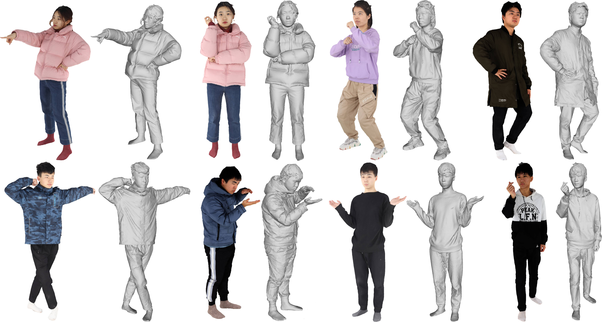

# Awesome-3D-Garments

Curation of research papers and datasets related to 3D garment digitization and simulation

Table of Contents
=================

- [Courses](#courses)
- [Papers](#papers)
	- [Classical Cloth Simulation](#classical-cloth-simulation)
	- [Neural Cloth Simulation](#neural-cloth-simulation)
	- [Collision Handling and Contact Friction Modeling](#collision-handling-and-contact-friction-modeling)
	- [DL for Simulation](#dl-for-simulation)
	- [Inverse Cloth Simulation](#inverse-cloth-simulation)
	- [Human and Garment Reconstruction and Simulation](#human-and-garment-reconstruction-simulation-and-rendering)
	- [Garment Retargetting](#garment-retargetting)
	- [Garment Generation](#garment-generation)
	- [Single View Clothed Human Reconstruction](#single-view-clothed-human-reconstruction)
	- [Learning Clothed Human Skinning](#learning-clothed-human-skinning)
- [Datasets](#datasets)
	- [Garment Dataset](#garment-dataset)
	- [Clothed Human Dataset](#clothed-human-dataset)

# Courses
- [Physics Based Animation](https://github.com/dilevin/CSC417-physics-based-animation?tab=readme-ov-file)
- Cloth Simulation: [1](https://graphics.stanford.edu/~mdfisher/cloth.html#EquationsOfMotion) [2](https://cg.informatik.uni-freiburg.de/course_notes/sim_03_cloth1.pdf)
- [Linear Implicit Solver](https://people.engr.tamu.edu/sueda/courses/CSCE489/2021F/assignments/A5/index.html)
- FEM Simulation of 3D Deformable Solids: [1](https://viterbi-web.usc.edu/~jbarbic/femdefo/barbic-courseNotes-modelReduction.pdf) [2](https://viterbi-web.usc.edu/~jbarbic/femdefo/barbic-courseNotes-modelReduction.pdf)

# Papers
## Classical Cloth Simulation
- [Large Steps in Cloth Simulation](https://www.cs.cmu.edu/~baraff/papers/sig98.pdf)
- [Numerical Methods in Cloth Simulation](https://www.wuwayne.com/files/clothsim/report.pdf)
- [Implicit and Explicit Methods of Cloth Simulation](https://www.cs.ru.ac.za/research/groups/vrsig/pastprojects/052cloth/paper03.pdf)
- [Position Based Dynamics](https://matthias-research.github.io/pages/publications/posBasedDyn.pdf)

  	#### Implementation
  	- [PBD](https://carmencincotti.com/2022-07-11/position-based-dynamics/)
  	- [Velvet](https://github.com/vitalight/Velvet)
  	  
- [Adaptive Anisotropic Remeshing for Cloth Simulation](http://graphics.berkeley.edu/papers/Narain-AAR-2012-11/Narain-AAR-2012-11.pdf)

	#### Implementations:
	- [ArcSim](https://github.com/DanielTakeshi/ARCSim-Installation-Instructions)
	- [Argus](https://github.com/lijieumn/argus-distribution)
 - [Cloth simulation and collision detection using geometry images](https://ujcontent.uj.ac.za/esploro/outputs/graduate/Cloth-simulation-and-collision-detection-using/9910105707691/filesAndLinks?index=0)
 - [Multi-Layer Thick Shells](https://dl.acm.org/doi/pdf/10.1145/3588432.3591489)

   
## Neural Cloth Simulation
- [Data-Free Learning of Reduced-Order Kinematics](https://nmwsharp.com/media/papers/neural-physics-subspaces/neural_physics_subspaces.pdf)
- [NeuralClothSim: Neural Deformation Fields Meet the Kirchhoff-Love Thin Shell Theory](https://arxiv.org/pdf/2308.12970.pdf)
- [A Neural-Network-Based Approach for Loose-Fitting Clothing](https://arxiv.org/pdf/2404.16896)
  
## Collision Handling and Contact Friction Modeling
- [An Implicit Frictional Contact Solver for Adaptive Cloth Simulation](https://www-users.cselabs.umn.edu/~lixx4611/contact_friction.html)
- [Robust Treatment of Collisions, Contact and Friction for Cloth Animation](https://graphics.stanford.edu/papers/cloth-sig02/cloth.pdf)
- [DiffCloth: Differentiable Cloth Simulation with Dry Frictional Contact](https://people.csail.mit.edu/liyifei/uploads/Li-liyifei-SM-EECS-2022-thesis.pdf)
- [Incremental Potential Contact: Intersection- and Inversion-free, Large-Deformation Dynamics](https://dl.acm.org/doi/pdf/10.1145/3386569.3392425)
- [Inverse Elastic Shell Design with Contact and Friction](https://inria.hal.science/hal-01883655/file/inverseShellModeling.pdf)
- [I-Cloth: Incremental Collision Handling for GPU-Based Interactive Cloth Simulation](https://min-tang.github.io/home/ICloth/files/icloth.pdf)
- [Implicit Contact Handling for Deformable Objects](https://media.disneyanimation.com/uploads/production/publication_asset/32/asset/EG2009_implicit_contact.pdf)
- [ClothCombo: Modeling Inter-Cloth Interaction for Draping Multi-Layered Clothes](https://arxiv.org/pdf/2304.03492.pdf)
  
## DL for Simulation
- [Neural Cloth Simulation](https://dl.acm.org/doi/pdf/10.1145/3550454.3555491) | [Code](https://github.com/hbertiche/NeuralClothSim/)
- [SNUG: Self-Supervised Neural Dynamic Garments](https://arxiv.org/pdf/2204.02219.pdf) | [Code](https://github.com/isantesteban/snug/tree/main)
- [HOOD: Hierarchical Graphs for Generalized Modelling of Clothing Dynamics](https://arxiv.org/pdf/2212.07242.pdf) | [Code](https://github.com/Dolorousrtur/HOOD/tree/main)
- [GenSim: Unsupervised Generic Garment Simulator](https://openaccess.thecvf.com/content/CVPR2023W/DLGC/papers/Tiwari_GenSim_Unsupervised_Generic_Garment_Simulator_CVPRW_2023_paper.pdf)

## Inverse Cloth Simulation
- [Φ-SfT: Shape-from-Template with a Physics-Based Deformation Model](https://4dqv.mpi-inf.mpg.de/phi-SfT/) | [Code](https://github.com/navamikairanda/phi_sft/tree/main)
- [Differentiable Cloth Simulation for Inverse Problems](https://gamma.umd.edu/researchdirections/virtualtryon/differentiablecloth) | [Code](https://github.com/williamljb/DifferentiableCloth/tree/master?tab=readme-ov-file)
- [Inverse Dynamic Modeling of Cloth](https://inria.hal.science/tel-03501532v1/document)
- [DiffXPBD : Differentiable Position-Based Simulation of Compliant Constraint Dynamics](https://arxiv.org/pdf/2301.01396.pdf)

## Human and Garment Reconstruction Simulation and Rendering
- [CaPhy: Capturing Physical Properties for Animatable Human Avatars](https://suzhaoqi.github.io/assets/pdf/CaPhy.pdf)
- [Dressing Avatars: Deep Photorealistic Appearance for Physically Simulated Clothing](https://arxiv.org/pdf/2206.15470.pdf)
- [PhysAvatar: Learning the Physics of Dressed 3D Avatars from Visual Observations](https://arxiv.org/pdf/2404.04421.pdf)
- [NeuralTailor: Reconstructing Sewing Pattern Structures from 3D Point Clouds of Garments](https://dl.acm.org/doi/pdf/10.1145/3528223.3530179)
- [Towards Garment Sewing Pattern Reconstruction from a Single Image](https://sewformer.github.io/)
- [Inverse Garment and Pattern Modeling with a Differentiable Simulator](https://arxiv.org/pdf/2403.06841)
- [Garment4D: Garment Reconstruction from Point Cloud Sequences](https://proceedings.neurips.cc/paper_files/paper/2021/file/eb160de1de89d9058fcb0b968dbbbd68-Paper.pdf)
  
## Garment Retargetting
- [DIG: Draping Implicit Garment over the Human Body](https://arxiv.org/pdf/2209.10845) | [Code](https://github.com/liren2515/DIG)
- [DrapeNet: Garment Generation and Self-Supervised Draping](https://arxiv.org/pdf/2211.11277.pdf) | [Code](https://github.com/liren2515/DrapeNet)
- [GAPS: Geometry-Aware, Physics-Based, Self-Supervised Neural Garment Draping](https://arxiv.org/pdf/2312.01490.pdf) | [Code](https://github.com/simonhfls/gaps)
- [ULNeF: Untangled Layered Neural Fields for Mix-and-Match Virtual Try-On](https://dancasas.github.io/docs/santesteban_NeurIPS2022.pdf)
- [Self-Supervised Collision Handling via Generative 3D Garment Models for Virtual Try-On](https://dancasas.github.io/docs/santesteban_CVPR2021.pdf)
- [ISP: Multi-Layered Garment Draping with Implicit Sewing Patterns](https://liren2515.github.io/page/isp/isp.html) | [Code](https://github.com/liren2515/ISP)

## Garment Generation
- [Garment3DGen: 3D Garment Stylization and Texture Generation](https://arxiv.org/pdf/2404.04421.pdf)
- [GarmentDreamer: 3DGS Guided Garment Synthesis with Diverse Geometry and Texture Details](https://arxiv.org/pdf/2405.12420)

## Clothed Human Reconstruction from Monocular Image/Video 
- [ANIM: Accurate Neural Implicit Model for Human Reconstruction from a single RGB-D image](https://marcopesavento.github.io/ANIM/ANIM_camera_ready.pdf)
- [SiTH: Single-view Textured Human Reconstruction with Image-Conditioned Diffusion](https://sith-diffusion.github.io/)
- [GaussianBody: Clothed Human Reconstruction via 3d Gaussian Splatting](https://arxiv.org/pdf/2401.09720)

  

## Learning Clothed Human Skinning
- [CloSET: Modeling Clothed Humans on Continuous Surface with Explicit Template Decomposition](https://arxiv.org/pdf/2304.03167.pdf)

# Datasets
## Garment Dataset 
### [Cloth3D](https://chalearnlap.cvc.uab.cat/dataset/38/description/)
This dataset contains a large collection of synthetic garment data obtained via animation SMPL models wearing different garments. They contain 6 different categories: t-shirt, top, dress, trousers, skirts and jumpsuits; each with different variation in topology such as length of sleeves, torso, legs, distance from body etc.  They also provide UV mapping, allowing one to swap in any desired textures. 

### [Deep Fashion3D](https://github.com/kv2000/deepFashion3D) 
They provide a collection of 3D garments obtained from 3D reconstruction of images. It contains over 2000 3D garment models, spanning 10 different cloth categories. Colored 3D point cloud of garments, body pose of underlying human body, line annotations are provided.

### [MGN](https://virtualhumans.mpi-inf.mpg.de/mgn)

### [SIZER](https://virtualhumans.mpi-inf.mpg.de/sizer/)

### [Generating Datasets of 3D Garments with Sewing Patterns](https://github.com/maria-korosteleva/Garment-Pattern-Generator)

## Clothed Human Dataset
### [3D Humans](https://cvit.iiit.ac.in/research/projects/cvit-projects/3dhumans)

### [THuman](https://github.com/ytrock/THuman2.0-Dataset)

### [XHumans](https://github.com/Skype-line/X-Avatar)

### [BUFF](https://buff.is.tue.mpg.de/)

### [4D-DRESS Dataset Subjects](https://eth-ait.github.io/4d-dress/)

### [MultiHuman](https://github.com/y-zheng18/MultiHuman-Dataset)

